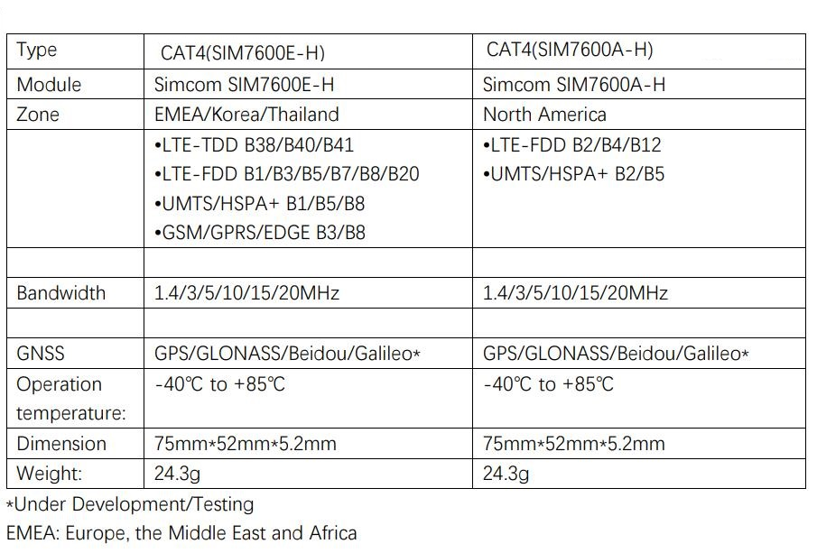

# 4G LTE Hat For Raspberry Pi

```c++
/*
Version:		V1.0
Author:			Vincent
Create Date:	2022/2/24
Note:
	
*/
```


[toc]

# Makerfabs

[Makerfabs home page](https://www.makerfabs.com/)

[Makerfabs Wiki](https://wiki.makerfabs.com/)

# 4G LTE Hat For Raspberry Pi
## Intruduce

Product Link ：[4G LTE Hat For Raspberry Pi(SIM7600X)]() 

Wiki Link : [4G LTE Hat For Raspberry Pi]() 

4G LTE Hat For Raspberry Pi integrated two types of the 4G LTE CAT4 module SIM7600A-H or SIM7600E-H, SIM7600A-H/SIM7600E-H is a complete multi-band LTE-FDD/LTE-TDD/HSPA+/UMTS/EDGE/GPRS/GSM module solution in LCC type which supports LTE CAT4 up to 150Mbps for downlink and 50Mbps for uplink data transfer, much faster and popular than 2G/3G.

It can be used as a wireless card with USB and raspberry PI connections. It can also be controlled through GPIO's hardware UART.

## Module Type




## Feature

- Supports dial-up, phone, SMS, TCP, UDP, DTMF, HTTP, FTP, and so on
- USB Type C port
- Control Via AT Commands
- Board USB supply voltage range: 4.8~5.5V, 5.0V Typical
- 3GPP E-UTRA Release 11
- IPEX Antenna, GSM/UMTS/LTE main antenna. UMTS/LTE auxiliary antenna. GNSS antenna
- SMS support
- Audio support
- Audio chip: NAU8810
- Level Shifter: TXS0108E


### Front:


### Back:


### Frequency bands


### Transfer Speed


## AT Command Explain

###  AT commands test

Refer to the official AT manual of SIM7600 for detailed return values.

```c++
    AT+CGMI    // Request manufacturer identification
    AT+CGMM    // Request model identification
    AT+CGSN    // Request product serial number identification
    AT+CSUB    // Request the module version and chip
    AT+CPIN?     // Request the state of the SIM card
    AT+CICCID    // Read ICCID from SIM card
    AT+CNUM      // Request the subscriber number
    AT+CNMP?     // Preferred mode selection
    AT+COPS?     // Check the current network operator
```

### Get the GNSS location

GPS signal acquisition speed depends on signal strength, please wait patiently in an open place.

```c++
    AT+CGPS=1      // Start GPS session 
    AT+CGPSINFO    // Get GPS fixed position information
    AT+CGPS=0      // Stop GPS session
```

### Send and receive SMS

Please consult the operator for the phone number of the SMS center. The number "+8613800755500" in Shenzhen was used in the test. 

```c++
    AT+CSCA="XXXXXX"       // Set the SMS service centre address
    AT+CMGF=1              // Select SMS message format
    AT+CMGS="xxxxxx"       // Send message to "xxxxxx"(the receiver number).
```

"AT+CMGS" sets the phone number of the receiver and returns ' >' . Send desired content, such as "Send Massage Test!".After editing a short message, send it in hexadecimal format 1A Send a message.

*The Arduino IDE cannot send hexadecimal,  you can use other software. In the example code, entering 1A or 1A will send 0x1A to the module.*


# Usage (Pi with USB)

## Equipment list


- Maduino Zero 4G (With GPS antenna and two 4G-GSM antennas)
- SIM card 

*Ensure that SIM7600 requirements are met and that the system can communicate with local carriers. We used China Mobile's 4G card for testing.*

- Connect all antennas
- Insert a SIM card
- Connect **USB for MCU** to Raspberry Pi USB


## Used as a 4G network adapter

### Hardware Check

- Log in to the root account and perform all subsequent operations as the root account.

```shell
sudo su
```

- Install the Minicom serial port tool.


```shell
apt-get install minicom
```

- To view the serial port device, AT command serial port: "/dev/ttyUSB2"

```shell
ls /dev/ttyUSB*
```


- Open the serial port with Minicom

```shell
minicom -D /dev/ttyUSB2
```

- Enter the AT command in minicom

```shell
# Forcibly set the Internet access to 4G
AT+CNMP=38
# Querying network Quality
AT+CSQ
# Query the network registry
AT+CREG?
# Querying Network Carrier Information
AT+COPS?
# Querying network band
AT+CPSI?
```


- \- Press Ctrl + A, then X to exit Minicom

At this point, the hardware and network connections between SIM7600CE and Raspberry Pi are normal. This case uses the 4G card of China Mobile. If you cannot use the other areas, please ask SIMCOM. 


### Driver Install

By default, Raspbian is installed with Qualcomm driver files for the wwan0 network port. For Raspberry Pi, you need to uninstall the driver first (otherwise it will conflict with the new driver), and then install the Simcom's driver for wwan0.

- Check system drivers

```shell
lsmod
```


- Uninstalling an existing driver

```shell
rmmod qmi_wwan
```

- Install the raspberry PI kernel header file
```shell
apt install raspberrypi-kernel-headers
```
- Download the official driver program provided by SIMCOM
```shell
wget https://www.waveshare.net/w/upload/0/00/SIM7600_NDIS.7z
```
- Install the decompression tool and decompress it
```shell
apt-get install p7zip-full
7z x SIM7600_NDIS.7z -r -o ./SIM7600_NDIS
```
- Go to the driver folder and compile

```shell
cd SIM7600_NDIS
make clean
make
ls
```

- Install the driver module file

```shell
insmod simcom_wwan.ko
```

- Check whether the installation is successful
```shell
lsmod
```


### Assign IP addresses

- In this case, the wwan0 network port is displayed

```shell
ifconfig -a
```
- However, no IP address is assigned to the network port. To assign an IP address, enable the network port first

```shell
ifconfig wwan0 up
```
- Then, through Minicom, enter the AT command to start dialing

```shell
minicom -D /dev/ttyUSB2
AT$QCRMCALL=1,1
```
- Finally, exit Minicom and assign IP

```shell
apt-get install udhcpc
udhcpc -i wwan0
```
- Run the Ping command to check whether the network adapter is connected

```shell
ping -I wwan0 www.baidu.com
```


# Usage (Pi with Uart)

We have connected the UART pin of SIM7600 to the UART of raspberry PI via GPIO.

SIM7600 can be connected using PySerial and other libraries. However, you need to set up the raspberry PI hardware UART, and it will use the Raspberry PI bluetooth.


The setting method is as follows:

```shell
#Set Pi uart
sudo raspi-config 

#Select interface options
#Select Serial Port
#Turn off serial login shell
#Open serial hardware
#Finish and reboot


#Install serial library
sudo apt-get update
sudo apt-get install pip
sudo pip install pyserial

python test.py
#Code is below
#Entry some at commands
```


**test.py**：

```python
import serial
from time import sleep
ser = serial.Serial("/dev/ttyS0", 115200)  # Open port with baud rate
while True:
    # Read cmd
    # You need press enter to receive new message
    # input() is block function
    cmd_input = input()
    if cmd_input != "":
        ser.write((cmd_input + "\r\n").encode('gbk'))

    # ser.write("AT".encode())  # It's error
    # ser.write("AT\r\n".encode('utf-8'))  # It's correct, contain "\r\n"
    sleep(1)
    

    # Receieve from SIM7600
    received_data = ser.read_all()  # read serial port
    print(received_data)  # print received bytes
    if received_data.decode() != "":
        print("Back:" + received_data.decode())  # print received data after decode

```


The AT-Command used are no different from those under Minicom.

**You need to manually add "\r\n", otherwise the module will just repeat the instructions you sent. **


# Usage （Windows）

- Connect one end of USB cable to USB interface of PC and the other end to USB_LTE interface of Maduino Zero 4G LTE.


- Open the device manager and you can see these COM ports.


- If the COM port is identified in the figure above, but an exclamation mark appears, it indicates that the driver is not installed.
- Driver is in "Maduino-Zero-4G-LTE\win_driver\SIM7600X-Driver.7z"
- Open Device Manager - > Other equipment - >“SimTech,Incorporated”- >  Update the driver - > Browse my computer to find driver files - > Select a path for saving the driver file based on the system- >The installation is complete.


- Install the driver for each exclamation point
- The network icon will then appear as a cellular network.


